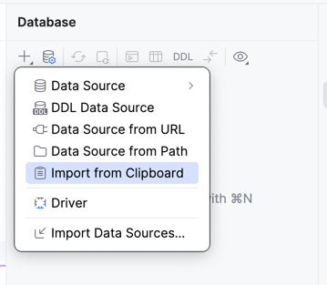

# PYGDA 

## Requirements

- Docker 
- PyCharm
- Just (Justfile)
- Python 3.11 (or newer)

## Setup

To setup dev environment run

```bash
just env-dev-setup
```

For all available options run
```bash
just
```

For working in shell with all settings loaded type
```bash
source env-dev.sh
```

### Database

To configure datasource in pycharm open `.datasources/pygda-dev` file and copy contents to clipboard.

Next click on the add datasource button in the database explorer and select past from clipboard 
